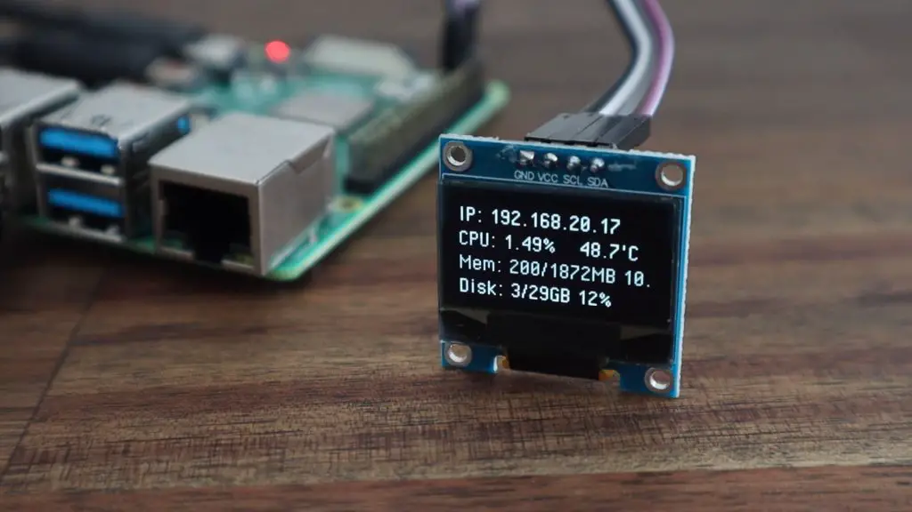
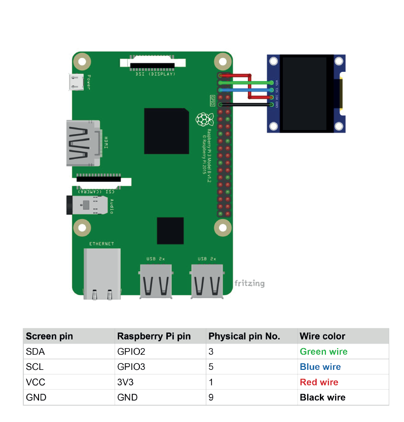
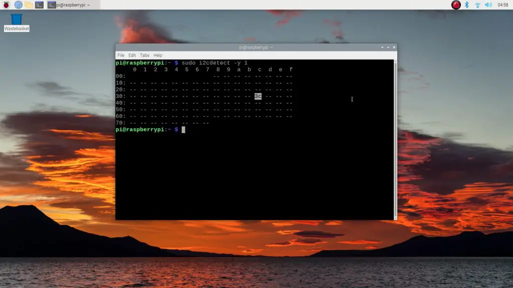

# OLED Stats display to Raspberry Pi OS BullsEye

I have tested this method successfully with a Raspberry Pi Zero W, Raspberry Pi 2B+, Raspberry Pi 3B and Raspberry Pi 4B.

This guide is based on [The DIY Life's great guide for a Pi 4 Desktop Case](https://www.the-diy-life.com/add-an-oled-stats-display-to-raspberry-pi-os-bullseye/), I simply simplified this part of the guide for future reference. 

## Resources

- A Raspberry Pi
- An SD Card
- A Raspberry Pi Power Supply
- A I2C 128x64 OLED Display
- 4 Female to Female Jumper cables

## Connect the display

I assume that you are familiar with the Raspberry Pi, have set it up with the latest OS and have access to it. 

- Make sure the Pi is off and disconnected to avoid shorting any connections. 
- Plug the jumpers to the Display's GPIO pins
- Plug the other ends of the jumpers into the Raspberry Pi’s GPIO pins

Once you've double (or triple) checked your connections, power up the Pi.

# Update the Pi and install the CircuitPython Library

In this first part we will upgrade the Pi to get all the latest updates and install setuptools. 
``sudo apt-get update``
``sudo apt-get full-upgrade``
``sudo reboot``
``sudo apt-get install python3-pip``
``sudo pip3 install --upgrade setuptools``

Make sure you are in the root directory
``cd ~``

Install ``adafruit-python-shell``
``sudo pip3 install --upgrade adafruit-python-shell``

Next, we download and install [raspi-blinka](https://github.com/adafruit/Raspberry-Pi-Installer-Scripts/tree/main)

Make sure you have git installed to do this. You can check the that git is installed by running ``git -v``. If a command not found error pops up, simply run ``sudo apt-get install git`` to install git. 

``git clone https://github.com/adafruit/Raspberry-Pi-Installer-Scripts.git``
``cd Raspberry-Pi-Installer-Scripts``
``sudo python3 raspi-blinka.py``

## Enable I2C from raspi-config

To enable I2C communication: 
- run ``sudo raspi-config``
- select **Interfacing Options > I2C** 
- select **Yes** on first prompt to enable I2C module
- select **Yes** when prompted to automatically load the I2C kernel module
- select **Finish**
- select **Yes** to reboot

## Check that your display is connected and recognised

We need to check that the display is properly connected and recognised by running ``sudo i2cdetect -y 1``

You should then see a table showing the I2C address of your display (typically 3c ). If you have multiple I2C connections, multiple addresses will be displayed.

## Download and setup the stats display script

Install the required libraries: 
``sudo pip3 install adafruit-circuitpython-ssd1306``
``sudo apt-get install python3-pil``

Download the script from [mklements](https://github.com/mklements) (a copy of the script is also available in this repo):
``git clone https://github.com/mklements/OLED_Stats.git``

We only need the stats.py file, we're going to copy it to our home folder and ignore the rest. 

``cp OLED_Stats/stats.py .``
``cp OLED_Stats/PixelOperator.ttf .``
``sudo rm -r OLED_Stats/``

You can then test the script by running ``python3 stats.py``

## Configuration for start on boot

We use cron to start the script on boot. To do this: 

- run ``sudo crontab -e`` (if it is your first time running it, you will have to select an editor first - I recommend nano for beginners). I recommend you use sudo here to avoid user access right issues when booting up the Pi. Although from a security standpoint it is not a good practice, also make sure that you auto-login (sudo raspi-config) when booting up the Pi.
- add the following line ``@reboot cd /home/<username> && python3 stats.py &``, making sure you replace your username and have the ``&`` at the end of the line. If you've changed the filename, make sure it is correct here as well. It should look something like this: ``@reboot cd /home/pi && python3 stats.py &``
- run ``sudo reboot`` to test if it works

## Future improvements

- add instructions for scrolling
- examples for displaying images
- examples for displaying other metrics (shell scripts)